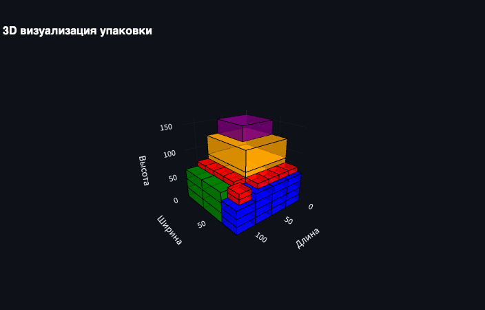

# 3D Pallet Packing Optimizer

Интерактивное веб-приложение для оптимизации 3D упаковки коробок на поддоны с использованием различных алгоритмов.
(Стоит отметить, что это все навайбкожено, потому стоит рассматривать решение с долей скепсиса, но как прототип вроде бы работает. 
Вообще сам проект есть тест вайбкодинга (уж очень интересно попробовать) на реальном приложении)

## Возможности

- **Несколько алгоритмов упаковки**: Weight-Aware, Extreme Points, LAFF, Corner Points, SFC
- **Веб-интерфейс**: Streamlit приложение с интуитивным интерфейсом
- **REST API**: FastAPI сервер для интеграции с другими системами
- **3D визуализация**: Интерактивные 3D-модели результатов упаковки
- **Валидация данных**: Комплексная проверка входных параметров
- **Экспорт результатов**: JSON, CSV, Excel форматы

## Входные форматы данных
- CSV файл должен содержать следующие колонки: name, length, width, height, weight, quantity
- Excel файл должен иметь аналогичную структуру с теми же колонками
- Все размеры указываются в сантиметрах, вес в килограммах

## Форматы сохранения результатов
- JSON: полная информация о упаковке, включая координаты размещения каждой коробки, статистику и параметры поддона
- CSV: упрощенный формат с основными параметрами упакованных коробок (имя, размеры, вес, координаты)
- Excel: расширенный формат с тремя листами:
  - "Упакованные": информация о размещенных коробках
  - "Неупакованные": список коробок, которые не удалось разместить
  - "Статистика": общие показатели упаковки


## Установка

```bash
git clone https://github.com/artyerokhin/3D-Pallet-Packing-Optimizer.git
cd 3D-Pallet-Packing-Optimizer
pip install -r requirements.txt
```


## Запуск

### Автоматический запуск всех сервисов

```bash
python start_services.py
```

### Запуск отдельных компонентов

**Только веб-интерфейс:**

```bash
streamlit run app.py
```

**Только API:**
```bash
python run_api.py
```


## Использование

### Веб-интерфейс
1. Откройте браузер и перейдите по адресу `http://localhost:8501`
2. Настройте параметры поддона
3. Выберите коробки или загрузите свой файл
4. Выберите алгоритм упаковки
5. Нажмите "Рассчитать упаковку"

### API
API доступен по адресу `http://localhost:8000`

**Создание задачи упаковки:**

POST /pack

**Проверка статуса:**

GET /status/{task_id}

**Получение результата:**

GET /result/{task_id}

## Примеры API

**Проверка работоспособности API**

```bash
# Проверка статуса API
curl -X GET "http://localhost:8000/health"

# Получение списка методов упаковки
curl -X GET "http://localhost:8000/methods"

# Получение стандартных коробок
curl -X GET "http://localhost:8000/standard-boxes"
```

**Простой запрос на упаковку**

```bash
curl -X POST "http://localhost:8000/pack" \
  -H "Content-Type: application/json" \
  -d '{
    "pallet": {
      "length": 120,
      "width": 80,
      "height": 160,
      "max_weight": 1000
    },
    "boxes": [
      {
        "name": "Коробка А",
        "length": 30,
        "width": 20,
        "height": 15,
        "weight": 2.5,
        "quantity": 5
      },
      {
        "name": "Коробка Б",
        "length": 25,
        "width": 25,
        "height": 20,
        "weight": 3.0,
        "quantity": 3
      }
    ],
    "method": "Weight-Aware (стабильная укладка с учетом веса)",
    "support_threshold": 0.8,
    "weight_check_enabled": true
  }'
```

**Расширенный пример с разными типами коробок**

```bash
curl -X POST "http://localhost:8000/pack" \
  -H "Content-Type: application/json" \
  -d '{
  "pallet": {
    "length": 120,
    "width": 80,
    "height": 160,
    "max_weight": 1500
  },
  "boxes": [
    {
      "name": "Маленькая коробка",
      "length": 20,
      "width": 15,
      "height": 10,
      "weight": 1.2,
      "quantity": 10,
      "fragile": false,
      "stackable": true
    },
    {
      "name": "Средняя коробка",
      "length": 40,
      "width": 30,
      "height": 25,
      "weight": 5.5,
      "quantity": 6,
      "fragile": false,
      "stackable": true
    },
    {
      "name": "Большая коробка",
      "length": 60,
      "width": 40,
      "height": 35,
      "weight": 12.0,
      "quantity": 2,
      "fragile": true,
      "stackable": false
    }
  ],
  "method": "Extreme Points (размещение по крайним точкам)",
  "support_threshold": 0.7,
  "weight_check_enabled": true
}'
```

**Тестирование разных алгоритмов**

```bash
# LAFF алгоритм
curl -X POST "http://localhost:8000/pack" \
  -H "Content-Type: application/json" \
  -d '{
    "pallet": {"length": 100, "width": 80, "height": 150, "max_weight": 800},
    "boxes": [
      {"name": "Тест1", "length": 30, "width": 20, "height": 15, "weight": 2.0, "quantity": 8}
    ],
    "method": "LAFF (Largest Area Fit First)"
  }'

# SFC алгоритм
curl -X POST "http://localhost:8000/pack" \
  -H "Content-Type: application/json" \
  -d '{
    "pallet": {"length": 120, "width": 80, "height": 160, "max_weight": 1000},
    "boxes": [
      {"name": "Тест2", "length": 25, "width": 25, "height": 20, "weight": 3.5, "quantity": 6}
    ],
    "method": "SFC (Space Filling Curve)"
  }'
```

**Пример с использованием Python requests**
```python
import requests
import json
import time

# Создание задачи
response = requests.post("http://localhost:8000/pack", json={
    "pallet": {
        "length": 120,
        "width": 80,
        "height": 160,
        "max_weight": 1000
    },
    "boxes": [
        {
            "name": "Тестовая коробка",
            "length": 30,
            "width": 20,
            "height": 15,
            "weight": 2.5,
            "quantity": 8
        }
    ],
    "method": "Weight-Aware (стабильная укладка с учетом веса)"
})

if response.status_code == 200:
    task_data = response.json()
    task_id = task_data["task_id"]
    print(f"Задача создана: {task_id}")
    
    # Ожидание результата
    while True:
        status_response = requests.get(f"http://localhost:8000/status/{task_id}")
        status = status_response.json()["status"]
        
        if status == "completed":
            result_response = requests.get(f"http://localhost:8000/result/{task_id}")
            result = result_response.json()
            print("Результат:", json.dumps(result, indent=2, ensure_ascii=False))
            break
        elif status == "failed":
            print("Ошибка упаковки")
            break
        
        time.sleep(1)
else:
    print(f"Ошибка: {response.status_code} - {response.text}")
```


## Форматы сохранения результатов

- **JSON**: Полная информация с координатами и аналитикой
- **CSV**: Упрощенный формат с основными параметрами
- **Excel**: Расширенный формат с множественными листами


## Алгоритмы упаковки

### Weight-Aware
- Учитывает вес коробок при размещении
- Настраиваемый уровень поддержки (50-90%)
- Предотвращает размещение тяжелых коробок на легких
- Проверка устойчивости центра тяжести
- Оптимизация использования пространства

### Extreme Points
- Динамическое определение точек размещения
- Оптимизация плотности упаковки
- Минимизация пустого пространства
- Случайный фактор для разнообразия решений
- Проверка поддержки снизу (настраиваемая)

### LAFF (Largest Area Fit First)
- Послойная укладка коробок
- Приоритет коробкам с большей площадью основания
- Оптимизация использования пространства в слое
- Эффективен для однородных грузов
- Проверка поддержки (настраиваемая в коде)

### Corner Points
- Размещение коробок в угловых точках
- Оптимизация по компактности упаковки
- Сортировка по объему и соотношению сторон
- Минимизация пустых пространств
- Проверка поддержки снизу (настраиваемая в коде)

### SFC (Space Filling Curve)
- Спиральное заполнение пространства
- Настраиваемая дискретизация пространства (grid_size = 15)
- Учет веса при размещении
- Проверка поддержки снизу (50% по умолчанию)
- Оптимизация для разных размеров коробок

## Структура проекта

```
3D-Pallet-Packing-Optimizer/
├── src/
│ ├── api/
│ │ ├── init.py
│ │ └── main.py # FastAPI приложение
│ ├── packers/
│ │ ├── init.py
│ │ ├── base_packer.py # Базовый класс
│ │ ├── weight_aware.py # Weight-Aware алгоритм
│ │ ├── extreme_points.py # Extreme Points алгоритм
│ │ ├── laff.py # LAFF алгоритм
│ │ ├── corner_points.py # Corner Points алгоритм
│ │ └── sfc.py # SFC алгоритм
│ ├── utils/
│ │ ├── init.py
│ │ ├── visualization.py # Функции визуализации
│ │ ├── constants.py # Константы
│ │ ├── file_handlers.py # Работа с файлами
│ │ ├── api_error_handler.py # Отображение ошибок API
│ │ ├── app_state_manager.py # Управление состоянием
│ │ └── streamlit_error_display.py # Отображение ошибок Streamlit
│ └── validation/
│ ├── init.py
│ └── validators.py # Система валидации
├── tests/
├── examples/
├── results/ # Создается автоматически
├── app.py # Streamlit приложение
├── run_api.py # Запуск API сервера
├── start_services.py # Запуск обоих сервисов
├── requirements.txt
└── README.md
```

## Лицензия

MIT License

## Запуск тестов

```bash
pytest tests/test_base.py -v
```

## Пример работы программы

